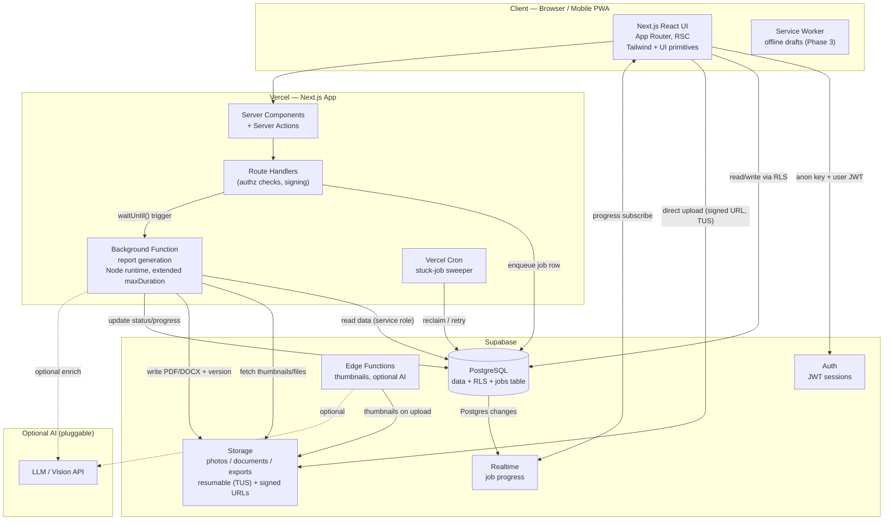
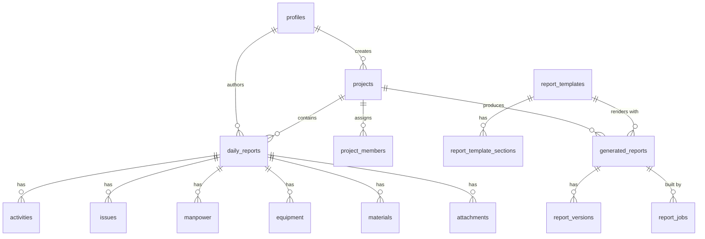
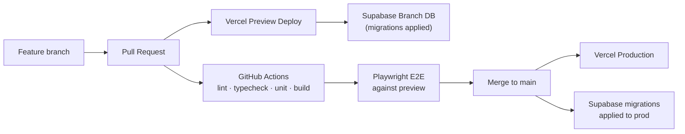

# Report Generator — Product & Technical Architecture Plan

> An internal company web app for capturing daily job/project progress and compiling it into professional, sectioned reports.
> **Stack:** Next.js (App Router) on Vercel + Supabase (PostgreSQL, Auth, Storage, Realtime).

**Status:** Planning document (v2 — single-tenant internal tool).
**Guiding principles:** simplicity, reliability, scalability, and excellent report generation — with minimal third-party dependencies and no over-engineering.

> **v2 change — no multi-tenancy.** This is an internal tool for one company, so there are no organizations and no memberships. Every authenticated user is a staff member of the one company; **roles live directly on `profiles`**, and RLS is an *authorization* layer (who may write what), not a tenant-isolation layer. This removes a join from every policy, a column from every table, and a whole invite/onboarding surface from the product.

---

## Table of Contents

1. [Product / MVP Scope](#1-product--mvp-scope)
2. [Architecture](#2-architecture)
3. [Database Design](#3-database-design)
4. [Storage Design](#4-storage-design)
5. [Daily Reporting UX](#5-daily-reporting-ux)
6. [Report Builder](#6-report-builder)
7. [Report Generation](#7-report-generation-the-hard-part)
8. [UI Structure](#8-ui-structure)
9. [Security](#9-security)
10. [AI Opportunities](#10-ai-opportunities)
11. [Testing & Deployment](#11-testing--deployment)
12. [Development Roadmap](#12-development-roadmap)
13. [Final Architecture Decision](#13-final-architecture-decision)

---

## 1. Product / MVP Scope

### 1.1 Problem & core value

Field teams capture daily progress in scattered notes, camera rolls, and spreadsheets. At project close, someone spends days manually assembling a report. **Report Generator turns structured daily entries + media into a compiled, professional report on demand.**

### 1.2 Primary workflows

1. **Set up** a project (job) — name, code, client, location, dates.
2. **Log daily** — a field user records progress, activities, issues/delays, manpower, equipment, materials, photos, and supporting files (PDF/Word/Excel), tagged with dates, location, and comments.
3. **Review** — a manager reviews/approves submitted daily reports.
4. **Compile** — select a project + date range + template, and generate a single professional report (PDF primary, DOCX secondary) that automatically organizes content, photos, and documents into sections.
5. **Deliver** — download or share the versioned report via a signed link.

### 1.3 User roles

Roles are a single value on the user's profile, assigned by an admin.

| Role | Can do |
|------|--------|
| **Admin** | Everything: manage users and roles, company settings/branding, all projects, templates, delete data, view audit log. |
| **Project Manager** | Create/configure projects, review & approve daily reports, build templates, generate reports. |
| **Field User** | Create/edit **own** daily reports (while draft), upload photos/files, add activities/issues/resources. |
| **Viewer** | Read-only access to projects, daily reports, files, and generated reports. |

> Enforced in the database via RLS (Section 9), not just in the UI.

### 1.4 MVP (essential) vs Future

**MVP — must ship:**

- Email/password auth; admin-managed user roles (no self-serve org signup — staff accounts only).
- Projects CRUD with status, dates, location, client.
- Daily report entry: progress notes, activities, issues, manpower, equipment, materials.
- Photo & document upload (direct-to-Storage, resumable for large files) with captions and tags.
- Drafts + autosave; "copy previous day"; mobile-friendly entry.
- One default report template; **PDF generation** over a date range with photos + documents organized into sections.
- Async generation with progress + versioned, signed-URL delivery.
- Role-based RLS on every table; audit logging of key actions.

**Phase 2 — production hardening:**

- **Report Builder** (configurable sections, ordering, filtering, photo placement) and multiple/custom templates.
- **DOCX** export; report versions & regeneration.
- Approvals workflow; project assignment; company branding (logo/colors) on reports.
- Bulk photo tagging; saved filters; dashboard analytics.

**Phase 3 — advanced:**

- AI assists (Section 10): summaries, photo captions, document classification, issue extraction.
- Offline-capable PWA for field entry; scheduled recurring reports; semantic search; webhooks/exports.

### 1.5 Explicit non-goals

No native mobile apps (responsive PWA instead), no built-in chat, no full project-management/Gantt suite, no invoicing/accounting, **no multi-tenancy or billing** (internal tool).

---

## 2. Architecture

### 2.1 Shape of the system

A **single Next.js application** deployed to Vercel is the whole frontend *and* the API/BFF layer. Supabase is the backend platform: Postgres (data + RLS), Auth, Storage, and Realtime. Heavy report generation runs as an **asynchronous background job on Vercel Functions** (Node runtime, extended duration) coordinated through a Postgres jobs table. Two managed platforms, nothing else required to run.



### 2.2 Frontend

- **Next.js App Router** with **React Server Components** for data-heavy reads and **Server Actions** for mutations, keeping data access and validation on the server.
- **Client state:** TanStack Query for cached lists and optimistic updates; React Hook Form + Zod for forms (schemas shared client/server).
- **UI:** Tailwind CSS with a small set of hand-rolled primitives (button, input, card, dialog, table) — accessible and dependency-light.
- **Auth:** `@supabase/ssr` for cookie-based sessions that work across RSC, Route Handlers, and middleware.
- **Uploads:** browser uploads **directly to Supabase Storage**; files never transit a Vercel function (Section 4).

### 2.3 Backend (Supabase)

- **Postgres** is the source of truth. Authorization rules that must always hold live in **RLS policies + constraints**, not only in app code.
- **Auth** issues JWTs consumed by the browser (anon key, RLS-scoped) and the server (service role for privileged work, trusted server code only).
- **Storage** holds photos, documents, and generated reports in private buckets with storage RLS.
- **Realtime** streams `report_jobs` progress to the UI.
- **Edge Functions (Deno)** are used sparingly for event-driven, low-memory tasks (thumbnails, AI calls). They are **not** used for heavy PDF rendering (memory-constrained — Section 7).

### 2.4 File processing

- **On upload:** the client compresses/resizes photos before upload; a Storage webhook triggers an Edge Function to generate a normalized **thumbnail** (~1024px long edge) and read EXIF (taken-at, GPS) into the `attachments` row.
- **Documents** (PDF/Word/Excel) are stored as-is with metadata recorded in Postgres.

### 2.5 Background jobs

Report builds are **never** run inline in a request. The API inserts a `report_jobs` row and triggers a background worker (`waitUntil()`); the worker generates the file, streams progress into Postgres (→ Realtime → UI), uploads the result, and writes a `report_versions` row. A **Vercel Cron** sweeper reclaims/retries stuck jobs. Full design in Section 7.

---

## 3. Database Design

### 3.1 Principles

- **One company, one database, no tenant column.** Access is decided by the user's **role** on `profiles`. Every table has RLS enabled; policies read the role, not a tenancy key.
- Every table: `id uuid default gen_random_uuid()`, `created_at timestamptz default now()`, and `updated_at` maintained by a trigger where mutated.
- **Cascade deletes** down the ownership chain (project → daily_report → line items/attachments).
- **Enums** for small closed sets (roles, statuses, severities); **jsonb** only for genuinely open config (template/section settings, report filters).

### 3.2 Entity overview



### 3.3 Core tables (representative DDL)

```sql
-- Identity & roles -----------------------------------------------------------
create type app_role as enum ('admin','project_manager','field_user','viewer');

-- Mirrors auth.users (1:1); created by a trigger on signup.
create table profiles (
  id          uuid primary key references auth.users(id) on delete cascade,
  full_name   text,
  email       text,
  avatar_path text,
  role        app_role not null default 'field_user',
  is_active   boolean not null default true,
  created_at  timestamptz not null default now(),
  updated_at  timestamptz not null default now()
);
create index on profiles (role) where is_active;

-- Company-wide settings: exactly one row (branding for report covers).
create table app_settings (
  id           boolean primary key default true check (id),   -- singleton guard
  company_name text not null default 'Company',
  logo_path    text,
  settings     jsonb not null default '{}',
  updated_at   timestamptz not null default now()
);

-- Projects -------------------------------------------------------------------
create type project_status as enum ('active','on_hold','completed','archived');

create table projects (
  id          uuid primary key default gen_random_uuid(),
  name        text not null,
  code        text unique,                   -- human job number
  description text,
  client_name text,
  location    text,
  status      project_status not null default 'active',
  start_date  date,
  end_date    date,
  created_by  uuid references profiles(id),
  created_at  timestamptz not null default now(),
  updated_at  timestamptz not null default now()
);
create index on projects (status, updated_at desc);

-- Assignment metadata (who works on what) — drives dashboards/filtering.
-- Not a security boundary: all staff can read all projects in an internal tool.
create table project_members (
  project_id uuid not null references projects(id) on delete cascade,
  user_id    uuid not null references profiles(id) on delete cascade,
  created_at timestamptz not null default now(),
  primary key (project_id, user_id)
);
create index on project_members (user_id);

-- Daily reports & line items -------------------------------------------------
create type report_status as enum ('draft','submitted','approved','rejected');

create table daily_reports (
  id           uuid primary key default gen_random_uuid(),
  project_id   uuid not null references projects(id) on delete cascade,
  report_date  date not null,
  author_id    uuid not null references profiles(id),
  status       report_status not null default 'draft',
  weather      text,
  temperature  numeric,
  summary      text,                        -- free-text progress narrative
  location     text,
  submitted_at timestamptz,
  approved_by  uuid references profiles(id),
  approved_at  timestamptz,
  autosaved_at timestamptz,                 -- drives draft/autosave UX
  created_at   timestamptz not null default now(),
  updated_at   timestamptz not null default now(),
  unique (project_id, report_date, author_id)
);
create index on daily_reports (project_id, report_date desc);
create index on daily_reports (status) where status = 'submitted';
create index on daily_reports (author_id, report_date desc);

create table activities (
  id               uuid primary key default gen_random_uuid(),
  daily_report_id  uuid not null references daily_reports(id) on delete cascade,
  title            text not null,
  description      text,
  category         text,
  percent_complete int check (percent_complete between 0 and 100),
  sort_order       int not null default 0
);
create index on activities (daily_report_id, sort_order);

create type issue_severity as enum ('low','medium','high','critical');
create type issue_status   as enum ('open','monitoring','resolved');

create table issues (
  id               uuid primary key default gen_random_uuid(),
  daily_report_id  uuid not null references daily_reports(id) on delete cascade,
  title            text not null,
  description      text,
  severity         issue_severity not null default 'medium',
  status           issue_status not null default 'open',
  delay_days       numeric,                 -- schedule impact
  resolved_at      timestamptz,
  sort_order       int not null default 0
);
create index on issues (daily_report_id, sort_order);
create index on issues (status) where status <> 'resolved';

-- Resources: manpower / equipment / materials
create table manpower (
  id              uuid primary key default gen_random_uuid(),
  daily_report_id uuid not null references daily_reports(id) on delete cascade,
  trade           text not null,            -- e.g. "Electricians"
  contractor      text,
  headcount       int not null default 0 check (headcount >= 0),
  hours           numeric check (hours >= 0),
  notes           text,
  sort_order      int not null default 0
);
create index on manpower (daily_report_id, sort_order);

create table equipment (
  id              uuid primary key default gen_random_uuid(),
  daily_report_id uuid not null references daily_reports(id) on delete cascade,
  name            text not null,
  quantity        int not null default 1 check (quantity >= 0),
  hours_used      numeric check (hours_used >= 0),
  status          text,                     -- operational / idle / down
  notes           text,
  sort_order      int not null default 0
);
create index on equipment (daily_report_id, sort_order);

create table materials (
  id              uuid primary key default gen_random_uuid(),
  daily_report_id uuid not null references daily_reports(id) on delete cascade,
  name            text not null,
  quantity        numeric,
  unit            text,
  supplier        text,
  notes           text,
  sort_order      int not null default 0
);
create index on materials (daily_report_id, sort_order);

-- Files: ONE polymorphic table for all uploads. Photos are attachments with
-- kind='photo' plus image metadata; a `photos` view keeps call sites readable.
create type attachment_kind as enum ('photo','document','other');

create table attachments (
  id              uuid primary key default gen_random_uuid(),
  project_id      uuid not null references projects(id) on delete cascade,
  daily_report_id uuid references daily_reports(id) on delete cascade, -- null = project-level
  kind            attachment_kind not null default 'other',
  bucket          text not null,            -- 'photos' | 'documents'
  storage_path    text not null,
  thumbnail_path  text,                     -- photos only
  file_name       text not null,
  mime_type       text not null,
  size_bytes      bigint not null,
  width           int,                      -- image metadata (photos only)
  height          int,
  taken_at        timestamptz,
  caption         text,
  sort_order      int not null default 0,
  uploaded_by     uuid references profiles(id),
  created_at      timestamptz not null default now(),
  unique (bucket, storage_path)
);
create index on attachments (daily_report_id, sort_order);
create index on attachments (project_id, kind, created_at desc);

create view photos as select * from attachments where kind = 'photo';

-- Tags & comments (polymorphic) ----------------------------------------------
create table tags (
  id    uuid primary key default gen_random_uuid(),
  name  text not null unique,
  color text
);

create table entity_tags (
  tag_id      uuid not null references tags(id) on delete cascade,
  entity_type text not null,   -- 'daily_report' | 'attachment' | 'project'
  entity_id   uuid not null,
  primary key (tag_id, entity_type, entity_id)
);
create index on entity_tags (entity_type, entity_id);

create table comments (
  id          uuid primary key default gen_random_uuid(),
  entity_type text not null,   -- 'daily_report' | 'activity' | 'issue' | 'attachment'
  entity_id   uuid not null,
  author_id   uuid not null references profiles(id),
  body        text not null,
  created_at  timestamptz not null default now()
);
create index on comments (entity_type, entity_id, created_at);

-- Templates & report sections ------------------------------------------------
create type section_type as enum
  ('cover','summary','activities','issues','manpower',
   'equipment','materials','photos','documents','custom');

create table report_templates (
  id          uuid primary key default gen_random_uuid(),
  name        text not null,
  description text,
  is_default  boolean not null default false,
  config      jsonb not null default '{}',   -- branding, page size, header/footer
  created_by  uuid references profiles(id),
  created_at  timestamptz not null default now(),
  updated_at  timestamptz not null default now()
);
create unique index one_default_template on report_templates (is_default) where is_default;

create table report_template_sections (
  id           uuid primary key default gen_random_uuid(),
  template_id  uuid not null references report_templates(id) on delete cascade,
  section_type section_type not null,
  title        text,
  sort_order   int not null default 0,
  config       jsonb not null default '{}',  -- photo grid cols, filters, include flags
  enabled      boolean not null default true
);
create index on report_template_sections (template_id, sort_order);

-- Generated reports, versions & async jobs -----------------------------------
create type job_status as enum ('queued','processing','completed','failed','cancelled');
create type report_format as enum ('pdf','docx');

create table generated_reports (
  id          uuid primary key default gen_random_uuid(),
  project_id  uuid not null references projects(id) on delete cascade,
  template_id uuid references report_templates(id),
  title       text not null,
  date_from   date not null,
  date_to     date not null,
  filters     jsonb not null default '{}',   -- tags, statuses, authors, section overrides
  created_by  uuid references profiles(id),
  created_at  timestamptz not null default now(),
  check (date_to >= date_from)
);
create index on generated_reports (project_id, created_at desc);

create table report_versions (
  id                  uuid primary key default gen_random_uuid(),
  generated_report_id uuid not null references generated_reports(id) on delete cascade,
  version_no          int not null,
  format              report_format not null default 'pdf',
  storage_path        text,                  -- set when completed
  size_bytes          bigint,
  page_count          int,
  created_by          uuid references profiles(id),
  created_at          timestamptz not null default now(),
  unique (generated_report_id, version_no, format)
);

create table report_jobs (
  id                  uuid primary key default gen_random_uuid(),
  generated_report_id uuid not null references generated_reports(id) on delete cascade,
  report_version_id   uuid references report_versions(id) on delete cascade,
  format              report_format not null default 'pdf',
  status              job_status not null default 'queued',
  progress            int not null default 0 check (progress between 0 and 100),
  step                text,                     -- human-readable current step
  error               text,
  attempts            int not null default 0,
  locked_at           timestamptz,              -- worker lease for the cron sweeper
  started_at          timestamptz,
  finished_at         timestamptz,
  created_at          timestamptz not null default now()
);
-- Fast "next queued job" and "stuck job" scans:
create index on report_jobs (status, created_at) where status in ('queued','processing');

-- Audit log ------------------------------------------------------------------
create table audit_logs (
  id          uuid primary key default gen_random_uuid(),
  actor_id    uuid references profiles(id),
  action      text not null,                 -- 'daily_report.submit', 'report.generate'
  entity_type text,
  entity_id   uuid,
  metadata    jsonb not null default '{}',
  created_at  timestamptz not null default now()
);
create index on audit_logs (created_at desc);
create index on audit_logs (entity_type, entity_id);
```

### 3.4 Key design decisions

- **No `org_id` anywhere.** With one company, a tenancy column is dead weight — it would appear on 15 tables, in every index, and in every policy, and never hold more than one value. Authorization is by **role**.
- **One `attachments` table, not separate `photos`/`documents` tables.** Photos are `kind='photo'` rows carrying image metadata. This avoids duplicated upload/authz logic and makes the report builder's "gather all media in this range" query trivial. A `photos` **view** keeps call sites readable.
- **`project_members` is assignment, not security.** Internal staff can read all projects; the table exists so dashboards can show "my projects" and reports can list the crew.
- **`sort_order` everywhere** the report renders lists, so users and the builder control ordering without extra tables.
- **Jobs live in Postgres**, giving transactional enqueue, Realtime progress for free, and trivial cron-based reclaim of stuck work — no external queue.

### 3.5 Indexing summary

- FK columns are indexed; hot read paths use composite indexes: `daily_reports (project_id, report_date desc)`, `attachments (project_id, kind, created_at desc)`.
- **Partial indexes** where the workload is skewed: submitted reports, open issues, the single default template, the queued/processing job scan.
- GIN indexes on `jsonb` only if querying inside them proves necessary (default: read the whole document).

---

## 4. Storage Design

### 4.1 Buckets (all private)

| Bucket | Contents | Notes |
|--------|----------|-------|
| `photos` | Original site photos + generated thumbnails | Thumbnails at `.../thumb/{id}.webp`. |
| `documents` | PDF / Word / Excel / other supporting files | Stored as-is. |
| `report-exports` | Generated PDF/DOCX report versions | Written by the worker; served via signed URLs. |
| `branding` | Company logo used on report covers | Small; referenced by `app_settings.logo_path`. |

No public buckets. Everything is served through **short-lived signed URLs** minted server-side after an authorization check.

### 4.2 Path convention (stable, ID-based)

```
photos/{project_id}/{daily_report_id}/{attachment_id}.{ext}
photos/{project_id}/{daily_report_id}/thumb/{attachment_id}.webp
documents/{project_id}/{daily_report_id}/{attachment_id}.{ext}
report-exports/{project_id}/{generated_report_id}/v{n}.{pdf|docx}
branding/logo.{ext}
```

- The first path segment is `project_id`, which keeps everything for a project (and its cleanup) in one prefix. Using immutable UUIDs rather than filenames prevents collisions; the original filename stays as display metadata in Postgres.

### 4.3 Metadata

The source of truth for file metadata is the **`attachments` / `report_versions` tables in Postgres**, not Storage object metadata — it's queryable, joinable, and RLS-protected. The DB row is created in the same flow as the upload so orphans are detectable (a nightly job reconciles Storage objects lacking a row).

### 4.4 Upload path (large files handled correctly)

- **Direct-to-Storage from the browser.** The server issues a **signed upload URL**; bytes go **straight to Storage**, never through a Vercel function — sidestepping serverless body-size and duration limits entirely.
- **Resumable uploads (TUS)** for anything above ~6 MB (large PDFs, high-res photo batches), giving pause/resume and network resilience for field users on flaky mobile connections.
- **Client-side pre-compression** of photos before upload to cut bandwidth; a Storage-triggered Edge Function produces the standardized thumbnail server-side.

### 4.5 Download / access

- All reads use **signed URLs with short TTL** (60–300 s for viewing, longer only for an explicit download), generated after the server confirms the user is an active staff member with an appropriate role.
- The report worker reads originals via the **service role** and writes exports back to `report-exports`; the finished report is delivered as a signed URL.

### 4.6 Lifecycle

- Deleting a `daily_report` or `project` cascades in Postgres; a scheduled cleanup removes now-orphaned Storage objects.
- Optional retention rules (archive projects after N months) in Phase 3.

---

## 5. Daily Reporting UX

The daily entry screen is the product's center of gravity — **it must be fast on a phone, one-handed, in the field, on a bad connection.**

### 5.1 Principles

- **Draft-first with autosave.** A daily report is created as a `draft` on open and autosaved (debounced ~1–2 s), updating `autosaved_at`. Nothing is ever lost; "Submit" is a separate, deliberate status change.
- **Progressive, sectioned form** on one scrollable page: Summary → Activities → Issues → Manpower/Equipment/Materials → Photos → Documents → Tags/Comments. Each section is collapsible; only Summary is needed to save a draft.
- **Repeatable rows** for activities/issues/resources with add/remove and reordering (`sort_order`), keyboard- and touch-friendly.

### 5.2 Accelerators

- **"Copy previous day."** One tap clones the prior day's manpower/equipment/materials (and optionally activities) into today's draft — the biggest real-world time saver, since crews and kit change little day to day.
- **Bulk photo upload.** Multi-select from the camera roll; uploads run **in parallel, directly to Storage**, with per-file progress, thumbnails appearing as they land, and inline captioning/tagging afterward. Failed uploads retry without redoing the batch.
- **Smart defaults.** Date defaults to today; location prefills from the project; recently used trades/equipment/materials surface as quick-add chips.
- **Offline drafts (Phase 3).** Service worker + IndexedDB queue entries and photos while offline and sync when connectivity returns.

### 5.3 Mobile-first specifics

- Large tap targets, sticky "Save draft / Submit" bar, native date/number inputs, camera capture via `<input capture>`.
- Optimistic UI so edits feel instant; a subtle "Saved" indicator reflects `autosaved_at`.
- Review/approve is a manager desktop flow: a queue of `submitted` reports with inline approve/reject + comment.

---

## 6. Report Builder

The builder turns a project + date range into a configured document definition that the generator renders.

### 6.1 Inputs

- **Scope:** project + `date_from`/`date_to` (or "entire project").
- **Template:** start from the default or a saved template; per-report overrides are allowed without mutating the template.
- **Filters:** by tag, author, issue status/severity, or specific daily reports; "include only approved" toggle.

### 6.2 Configurable sections

Sections come from `report_template_sections` and are controllable per report:

- **Reorder** via drag-and-drop (`sort_order`).
- **Toggle** sections on/off (`enabled`).
- **Per-section config (`jsonb`):** photos → grid columns (1–4), captions on/off, group-by day vs activity, max per day; activities → group by category; documents → embed vs link.
- **Photo placement:** inline within the day they belong to, **or** consolidated into a photo appendix — a per-section choice.
- **Documents:** attached as an appendix with a linked index, or native PDFs merged inline (Section 7.4).

### 6.3 Preview & versions

- **Live HTML preview** renders the exact section model the PDF/DOCX will use, so what you see maps to the output.
- **Generate** creates a `generated_reports` row (first build) and a `report_versions` row per build. Rebuilding after edits produces **v2, v3, …** — nothing is overwritten, giving an auditable history and easy "download previous version."
- Templates are reusable across projects; "Save as template" captures the current section layout/config.

---

## 7. Report Generation (the hard part)

This is where the product wins or loses, especially for large reports with **hundreds of images and documents** under serverless constraints.

### 7.1 The constraints, named honestly

- **Vercel Functions** (Node runtime, Fluid Compute) allow extended `maxDuration` (multi-hundred-second) and up to ~4 GB memory — enough for large reports *if memory is bounded*. Hobby-tier limits are far tighter (~60 s), so production runs on Pro.
- **Supabase Edge Functions** (Deno) are memory-limited — great for thumbnails and AI calls, **wrong** for rendering a several-hundred-image PDF. We deliberately do **not** render reports there.
- **Headless Chrome on serverless** (Puppeteer + `@sparticuz/chromium`) gives pixel-perfect HTML→PDF but has heavy cold starts, high memory, and fragility at scale. We avoid it as the primary path.

### 7.2 Recommended approach

**PDF via `@react-pdf/renderer` (primary), DOCX via the `docx` library (secondary), run in an asynchronous Vercel background Function, coordinated by a Postgres jobs table.** No headless browser, no extra services.

Why:

- `@react-pdf/renderer` is **pure JS** — no Chromium binary, predictable memory, streamable output, and a React component model that maps 1:1 onto our section components. It handles hundreds of images when fed **thumbnails, streamed, with bounded concurrency**.
- `docx` is **pure JS** OOXML generation, so DOCX reuses the same section model.
- Keeping generation in a **Vercel Node function** buys the memory/time headroom large reports need while staying inside the two-platform footprint.

### 7.3 Async pipeline

```mermaid
sequenceDiagram
    participant U as User (Builder)
    participant API as Next.js API (Vercel)
    participant DB as Postgres (report_jobs)
    participant W as Background Worker (Vercel Fn)
    participant S as Supabase Storage
    participant RT as Realtime

    U->>API: POST /reports/generate (scope, template, filters)
    API->>DB: insert generated_reports + report_versions(vN) + report_jobs(queued)
    API-)W: trigger via waitUntil() (background)
    API-->>U: 202 Accepted { jobId }
    U->>RT: subscribe to report_jobs row
    W->>DB: claim job (status=processing, locked_at=now)
    loop per section / per image batch
        W->>S: fetch thumbnails (bounded concurrency)
        W->>W: render section → stream into PDF
        W->>DB: update progress %
        DB-)RT: change event
        RT-)U: progress bar updates
    end
    W->>S: upload report-exports/.../vN.pdf
    W->>DB: report_versions.storage_path set; job=completed
    DB-)RT: completed
    U->>API: request signed download URL
    API-->>U: signed URL (short TTL)
```

- **Trigger:** the API returns immediately (`202` + `jobId`) and starts the worker with `waitUntil()`. A **Vercel Cron** (every minute) is the safety net: it reclaims jobs stuck in `processing` past a lease (`locked_at`) and retries `queued` jobs the trigger missed, with capped `attempts`. At-least-once execution without an external queue.
- **Progress:** the worker writes `progress`/`step` to the job row; **Realtime** streams it to the builder's progress bar. No polling.
- **Delivery:** on completion the client requests a signed URL for the new `report_versions` row.

### 7.4 Keeping large reports within limits (the important part)

1. **Thumbnails in the body, originals on demand.** Reports embed ~1024px thumbnails (~100–200 KB each), *not* multi-MB originals. Hundreds of thumbnails stay well within memory and produce a reasonably sized PDF. **This single decision is what makes "hundreds of images" tractable.**
2. **Bounded-concurrency image fetch** (`p-limit` at 5–10) so we never hold all images in memory at once; buffers are released as sections render.
3. **Stream, don't buffer.** Render to a stream and pipe straight to a Storage upload rather than building the whole file in memory.
4. **Chunk enormous reports.** For very large scopes, render **per-section or per-month sub-PDFs** and merge with `pdf-lib`, bounding peak memory regardless of total size.
5. **Native PDF documents** in the appendix are **merged with `pdf-lib`** (fast, no rasterization); Word/Excel files are referenced with a linked index rather than converted (conversion would need an office engine we intentionally don't add).
6. **Idempotent & resumable.** A retried job re-renders the same `version_no` deterministically; partial Storage output is overwritten safely.

### 7.5 When a report is genuinely huge

If a single report would exceed even the extended function window, the chunked sub-document strategy (7.4.4) keeps each invocation bounded and the cron advances the next chunk — so the ceiling scales without a separate worker service. A dedicated container worker remains a **documented escape hatch**, not a day-one dependency.

### 7.6 Format recommendation

- **PDF is the primary deliverable** (fidelity, universality, print).
- **DOCX secondary**, for clients who need to edit — same section model.
- **HTML preview** always available in-app.

---

## 8. UI Structure

- **Dashboard** — recent daily reports, open issues, pending approvals, my projects, quick "New daily report."
- **Projects** — list/grid with status, dates, client, last activity; project detail with tabs (Overview, Daily Reports, Files, Reports, Team).
- **Daily Reports** — calendar/list of entries for a project; the **entry screen** (Section 5) is the workhorse; review queue for managers.
- **Files** — all photos and documents for a project, filterable by date/tag/kind; grid gallery with lightbox + bulk caption/tag; table for documents.
- **Reports** — the **Report Builder** (Section 6): configure → preview → generate; plus a history of generated reports with versions, live job progress, and download/regenerate.
- **Templates** — manage templates and their sections; reorder, per-section config, set default, "Save as template."
- **Settings** — Company (name, logo/branding for reports), Users & roles (admin only), Tags, Audit log viewer, Account/profile.

Cross-cutting: global project switcher, responsive layouts everywhere, daily entry tuned mobile-first.

---

## 9. Security

### 9.1 Access model

**One company, one database. RLS is the authorization layer, not a tenancy boundary.** Every table has RLS enabled. The browser only ever uses the anon key + the user's JWT, so a user cannot exceed their role even with a crafted query. The service role key is used **only** in trusted server code (Server Actions, the worker) and never shipped to the client.

The base rule for an internal tool: **any active, authenticated staff member may read operational data; writes are gated by role; only admins manage users and settings.**

### 9.2 Role helpers

```sql
-- Current user's role (SECURITY DEFINER avoids recursive RLS on profiles).
create or replace function current_app_role() returns app_role
language sql stable security definer set search_path = public as $$
  select role from profiles where id = auth.uid() and is_active
$$;

create or replace function has_role(roles app_role[]) returns boolean
language sql stable security definer set search_path = public as $$
  select coalesce(current_app_role() = any(roles), false)
$$;

-- Convenience: anyone who may create/edit operational content.
create or replace function can_write() returns boolean
language sql stable security definer set search_path = public as $$
  select has_role(array['admin','project_manager','field_user']::app_role[])
$$;
```

### 9.3 Example RLS policies

```sql
alter table daily_reports enable row level security;

-- Read: any active staff member (including viewers).
create policy dr_select on daily_reports
  for select using (current_app_role() is not null);

-- Insert: field_user and up, and only as yourself.
create policy dr_insert on daily_reports
  for insert with check (can_write() and author_id = auth.uid());

-- Update: the author while still a draft, or managers/admins anytime.
create policy dr_update on daily_reports
  for update using (
    (author_id = auth.uid() and status = 'draft' and can_write())
    or has_role(array['admin','project_manager']::app_role[])
  );

-- Delete: managers/admins only.
create policy dr_delete on daily_reports
  for delete using (has_role(array['admin','project_manager']::app_role[]));
```

Line-item tables (`activities`, `issues`, `manpower`, …) inherit the same intent via an `exists` check against their parent report, so a field user can only mutate rows belonging to their own draft. `viewer` gets **select only** — no insert/update/delete policy grants it write access anywhere. Role changes and `app_settings` are **admin-only**, and a user cannot change their own role (enforced in policy).

### 9.4 Storage security

- All buckets **private**. Reads are allowed for any active staff member; writes are role-gated:

```sql
create policy "staff read photos"
on storage.objects for select
using (bucket_id = 'photos' and current_app_role() is not null);

create policy "writers upload photos"
on storage.objects for insert
with check (bucket_id = 'photos' and can_write());
```

- `report-exports` is **written only by the service role** (the worker); users receive short-TTL signed URLs after a server-side authorization check.

### 9.5 Auditability

- `audit_logs` records security-relevant actions (submit/approve daily report, generate/download report, role changes, deletions) with actor, entity, and metadata — written from server code so it can't be bypassed by the client.
- `updated_at` triggers + `report_versions` history give change traceability where it matters.

### 9.6 Application-layer hygiene

- Zod validation on every mutation (shared client/server); Server Actions re-check role even though RLS is the backstop (defense in depth).
- CSRF handled by Server Actions; secrets only in server env; rate-limit auth and generation endpoints; run Supabase advisors in CI.

---

## 10. AI Opportunities

**The core product is fully functional without any AI.** AI is layered on as optional enrichment behind feature flags, always with a human in the loop.

| Opportunity | Where | Value | Guardrail |
|-------------|-------|-------|-----------|
| **Period summaries** | Report build | Draft an executive summary from daily narratives + issues. | Editable draft, never auto-published; labeled AI-generated. |
| **Photo captions** | On upload (vision) | Auto-suggest captions/alt text for hundreds of site photos. | Suggestions only; user accepts/edits; batched, rate-limited. |
| **Document classification** | On upload | Auto-tag a file as RFI / invoice / drawing / spec to route it into the right section. | Confidence threshold; falls back to "document". |
| **Issue extraction** | Daily entry | Surface likely issues or delays from free-text notes. | Proposes structured `issues` rows for confirmation. |
| **Semantic search** (Phase 3) | Files/Reports | "All electrical delays in March" via `pgvector`. | Additive; keyword search remains. |

Design rules: AI outputs are **suggestions stored alongside** human fields (never overwriting), the provider is **pluggable**, calls are **async and rate-limited**, and everything degrades gracefully when AI is disabled.

---

## 11. Testing & Deployment

### 11.1 Pipeline (GitHub → Vercel → Supabase)



### 11.2 Environments

- **Local:** `supabase start` runs the full stack in Docker; app runs against it with a deterministic seed.
- **Preview:** every PR gets a Vercel preview + a Supabase branch database with migrations applied.
- **Production:** Vercel production + the primary Supabase project.

### 11.3 Migrations

**Supabase CLI migrations** are the single source of truth for schema, checked into git and **applied in CI**, never hand-edited in the dashboard. `supabase gen types typescript` keeps end-to-end TypeScript types in sync.

### 11.4 Testing layers

- **Unit:** Vitest for the section model, filters, report assembly, and Zod schemas.
- **Integration:** the async job pipeline and **RLS policies** — tests asserting a viewer cannot write and a field user cannot edit someone else's report (security is tested, not assumed).
- **E2E:** Playwright covering the two critical journeys — *daily entry with photo upload* and *generate a report end-to-end*.
- **Generation smoke test:** a fixture project with a few hundred seeded photos to guard memory/time regressions.

### 11.5 CI/CD

GitHub Actions: install → lint → typecheck → unit → build → (preview) E2E. Merges to `main` promote the Vercel production deploy and apply prod migrations. Secrets in GitHub/Vercel/Supabase env stores; nothing in the repo.

---

## 12. Development Roadmap

### Phase 1 — MVP — ~5–7 weeks
Auth + roles on profiles (RLS from day one) → Projects → **Daily report entry** (drafts/autosave, activities/issues/resources) → **Direct-to-Storage photo/doc upload** with thumbnails → default template → **async PDF generation** with progress + versioned signed delivery → audit logging → CI/CD, migrations, core E2E.
**Exit criteria:** a user can log a week of daily reports with photos and generate a clean multi-section PDF over a date range.

### Phase 2 — Production — ~5–7 weeks
**Report Builder** (section ordering/config, filters, photo placement) → multiple templates → **DOCX** → report versions/regeneration → approvals workflow → project assignment → company branding on reports → Files gallery with bulk tag/caption → dashboard analytics → RLS test suite, rate limiting, monitoring.

### Phase 3 — Advanced — ongoing
AI assists behind flags → offline PWA field entry → scheduled/recurring reports → semantic search (`pgvector`) → webhooks/exports, retention policies.

---

## 13. Final Architecture Decision

**Recommended, committed choices:**

- **Stack:** **Next.js (App Router, RSC + Server Actions) on Vercel** + **Supabase (Postgres, Auth, Storage, Realtime)**; **Tailwind** with hand-rolled UI primitives; TanStack Query + React Hook Form + Zod; `@supabase/ssr` for sessions. Two managed platforms, nothing else required to run.
- **Schema approach:** **Single database, no tenancy column, authorization by `role` on `profiles`, enforced by RLS on every table.** One polymorphic `attachments` table (photos = `kind='photo'` + image metadata) with a `photos` view. Enums for closed sets; `jsonb` for open config. Jobs and versions modeled in Postgres.
- **Storage strategy:** **Private buckets, ID-based paths prefixed by `project_id`, direct-to-Storage uploads (resumable TUS for large files), signed URLs for all access.** File metadata in Postgres; thumbnails power the report body.
- **Report generation:** **Asynchronous background jobs on Vercel Node Functions**, state in a Postgres `report_jobs` table, progress via Realtime, output to `report-exports`. **`@react-pdf/renderer` for PDF (primary), `docx` for DOCX (secondary)** — pure-JS, no headless Chrome. Large reports stay bounded via **thumbnails-in-body**, bounded-concurrency fetch, streaming, and **`pdf-lib` chunked merge**; a Vercel Cron sweeper guarantees at-least-once completion.
- **Repository structure:** a **single Next.js app repo** (no premature monorepo):

```
report-generator/
├─ app/                 # App Router routes
│  ├─ (auth)/           # login
│  ├─ (app)/            # authenticated shell: dashboard, projects, reports, ...
│  └─ api/              # route handlers: uploads, reports/generate, worker, cron
├─ components/          # UI primitives + shared components
├─ features/            # daily-reports, files, report-builder, templates
├─ lib/
│  ├─ supabase/         # server & browser clients, typed queries
│  ├─ reports/          # section model, PDF renderer, pdf-lib merge
│  └─ validation/       # shared Zod schemas
├─ supabase/
│  ├─ migrations/       # SQL migrations (source of truth)
│  └─ seed.sql
├─ tests/               # vitest unit tests
└─ .github/workflows/   # CI
```

**Why this wins:** it keeps the operational surface to Vercel + Supabase, pushes correctness into the database (RLS + constraints) where it can't be bypassed, drops an entire tenancy layer that an internal tool would never use, and solves the one genuinely hard problem — compiling hundreds of photos and documents into a professional report — with a pure-JS, memory-bounded, asynchronous pipeline that scales by chunking rather than by adding infrastructure.
